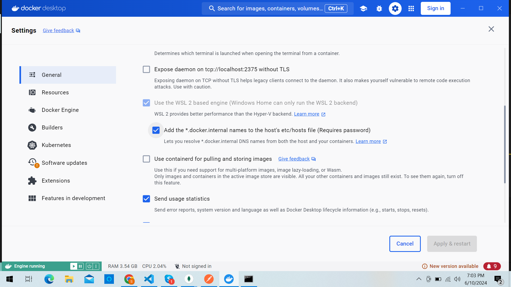

## Getting Started

1. **Navigate to the Project Directory:**

    ```bash
    cd askondata
    ```

2. **Build Docker Image:**

    ```bash
    sudo docker-compose build
    ```

3. **Start MongoDB Local:**

    ```bash
    sudo docker-compose up -d
    ```

4. **Set Environment Variable:**

    ```bash
    set APP_ENVIRONMENT=test
    set MONGO_PASSWORD=test or $env:MONGO_PASSWORD="test"
    ```
5. **Setup Docker Desktop**
    ```bash
    Add the *.docker.internal names to the hosts etc/hosts file (Requires password)
    this option should be checked
    ```


5. **Run Tests:**

    ```bash
    python askondata\mongo_create.py
    pytest askondata\tests
    ```

6. **Run Tests: in a particular file**
    ```bash
    pytest askondata\tests\<path to py file>
    ```

7. **Run Tests: of a particular class**
    ```bash
    pytest askondata\tests\<path to py file>::<class name>
    ```

8. **Run Tests: a single test case**
    ```bash
    pytest askondata\tests\<path to py file>::<class name>::<test_case_name>
    ```


9. **Run Tests: which require vpn**
    ```bash
    set APP_ENVIRONMENT=t                 #unset the test environment
    pytest .\askondata\tests -k "with_vpn"
    ```